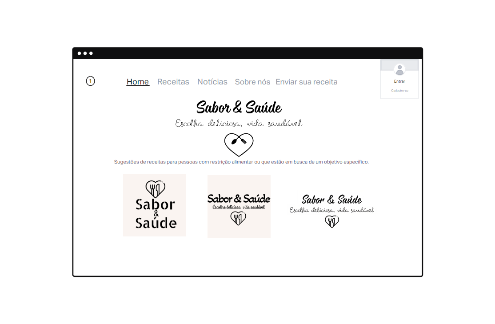
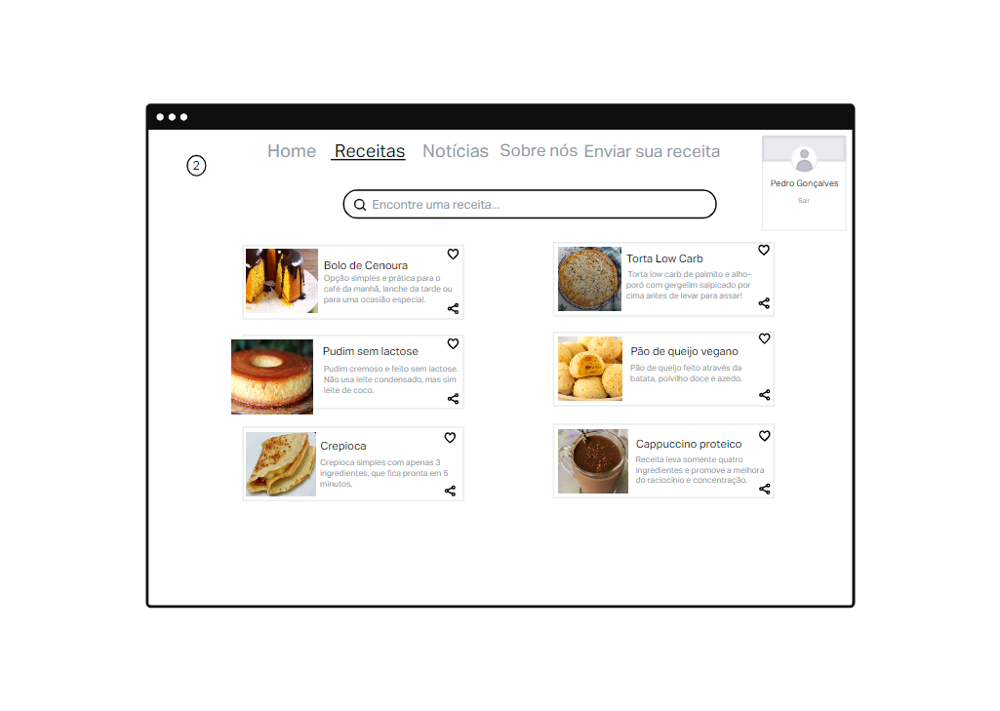
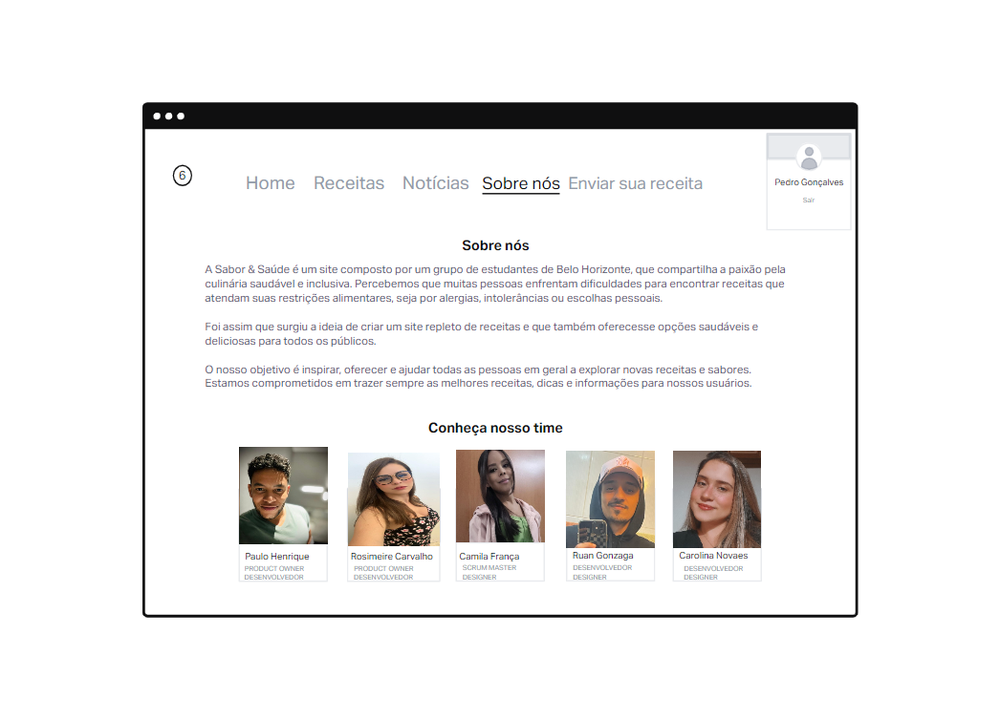

# Projeto de Interface

Pré-requisitos: <a href="2-Especificação do Projeto.md"> Documentação de Especificação</a>

Para a criação de um site, alguns pontos precisam ser considerados, em primeiro lugar ele deve ser eficaz, fácil de usar, intuitivo e atraente visualmente. O site foi projetado com uma estrutura de navegação clara e organizada, tornando fácil para os usuários encontrarem o que estão procurando. Outro aspecto fundamental é o conteúdo, relevante e bem escrito. Nele podemos ver imagens de alta qualidade, o que gera interação e o interesse por parte dos usuários.

## Wireframes
Os Wireframes são esboços do projeto de um site, que represetam de uma forma visual e básica a estrutura do site, nas páginas a seguir, veja o detalhamento de cada uma dessas páginas.

**Home**:
  A Home page é uma de grande importância no site, pois é a página que o que o usuário visualiza primeiro e essa impressão inicial é determinante.
Neste projeto a Home page, se apresenta da seguinte forma:
 
**Cabeçalho** - nesta parte está tudo o que é fixo, permite uma visão clara de todas as informações e conteúdos possíveis de serem encontrados, sem muitos cliques o usuário encontra as informações, o que facilita a pesquisa.
 **Logomarca** - foi disposta na parte central do site propositalmente, o objetivo é de chamar a atenção para o conteúdo de cada página.
 **Login** - no canto superior do lado direito, foi criado o espaço para login do nosso usuário, cujo o cadastro é bem simples e rápido.

As páginas do site, estão divididas da seguinte forma: “Home page”, “Receitas”, “Notícias”, “Sobre nós” e “Envie sua receita”, há uma grande preocupação quanto a qualidade do site e dos conteúdos, para que sejam sempre confiáveis e atualizados.
 
 
**Página de receitas**:
 
Como pode ser visto  abaixo, na parte superior da página, o campo de pesquisa está bem localizado o que estimula a interação com site:

**Página da receita selecionada**:
 
As receitas são muito importantes, pois estão atreladas ao objetivo principal desse site, além do campo de busca, o usuário sempre terá conteúdos recentes para auxiliar e ao mesmo tempo estimular a escolha pelos pratos, a partir das sugestões.

 
A apresentação da receita também foi estruturada de uma forma padronizada e organizada, qualquer receita do site, deve seguir todos os critérios da plataforma, como pode ser visto a seguir, a ordem estabelecida foi : nome de prato, ingredientes, modo de preparo e avaliação de outros usuários.
 
 
**Notícias**:
As notícias são mostradas para agregar conhecimento aos usuários, o que estimula uma reflexão acerca de cuidados, hábitos e comportamentos, no caso do site, ela sempre é uma atualização na área da alimentação.

 
 
**Notícia aberta**:
 Ao clicar em uma notícia, o usuário tem acesso a todo o conteúdo, mantendo os padrões do site, vejam como a imagem da tela de notícias de forma detalhada:

 
**Sobre Nós**:
  É a página que cria conexão entre o usuário e a organização, nela a empresa apresenta a sua história, formação, objetivos e etc.

  A apresentação da equipe com foto de todos os componentes, gera pessoalidade e isso aproxima os usuários que se identificam.
 
 
**Enviar a sua receita**:
 
É um ambiente pensado como 100% colaborativo e integrativo, é uma oportunidade para o site de ter muitos conteúdos, uma vez que esse quantitativo tende sempre a aumentar assim como a valorização e incentivo do empenho dos usuários.

 
Na plataforma a receita pode ser enviada de duas formas: através de um carregamento de um arquivo ou pelo preenchimento do formulário, como demonstrado na imagem acima.

