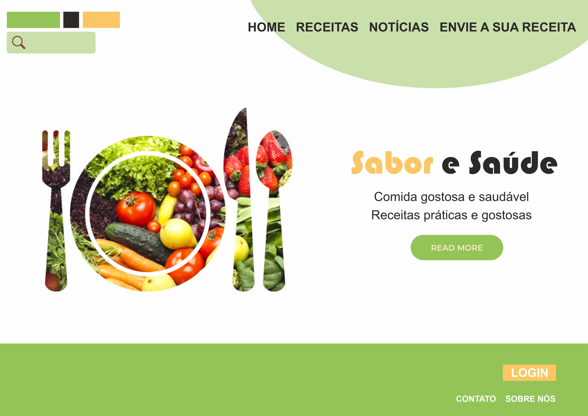
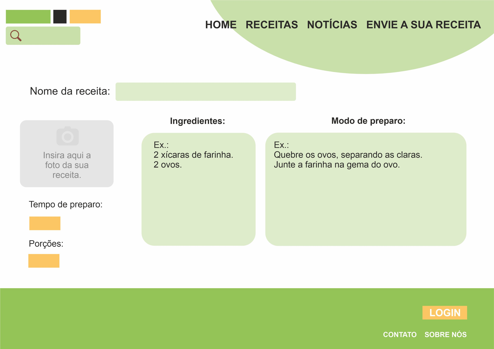

# Template padrão do site

Pré-requisitos: <a href="2-Especificação do Projeto.md"> Especificação do Projeto</a>, <a href="3-Projeto de Interface.md"> Projeto de Interface</a>, <a href="4-Metodologia.md"> Metodologia</a>

Layout padrão do site (HTML e CSS) que será utilizado em todas as páginas com a definição de identidade visual, aspectos de responsividade e iconografia.

<b>Tela Principal</b>
Tela que abrange todas as visualizações iniciais do site e a lista de notícias gerais.

<b>Tela de receitas</b>
 Local onde são exibidas as receitas de forma simplificada.

<b>Tela de receitas</b>
 Local onde são exibidas as receitas de forma completa.

<b>Tela de notícias </b>
 Local onde são exibidas as notícias de forma simplificada e gerais.

 
<b>Tela de Visualização de Notícias</b>
Local onde são exibidas as notícias de forma completa após seleção.
]

<b>Tela Sobre Nós</b>
Tela onde são exibidas as informações sobre equipe, história e contato.

<b>Tela de Envio de Receitas</b>
Local onde são exibidas as funções de colaboração e envio de receitas.

> **Links Úteis**:
>
> - [CSS Website Layout (W3Schools)](https://www.w3schools.com/css/css_website_layout.asp)
> - [Website Page Layouts](http://www.cellbiol.com/bioinformatics_web_development/chapter-3-your-first-web-page-learning-html-and-css/website-page-layouts/)
> - [Perfect Liquid Layout](https://matthewjamestaylor.com/perfect-liquid-layouts)
> - [How and Why Icons Improve Your Web Design](https://usabilla.com/blog/how-and-why-icons-improve-you-web-design/)