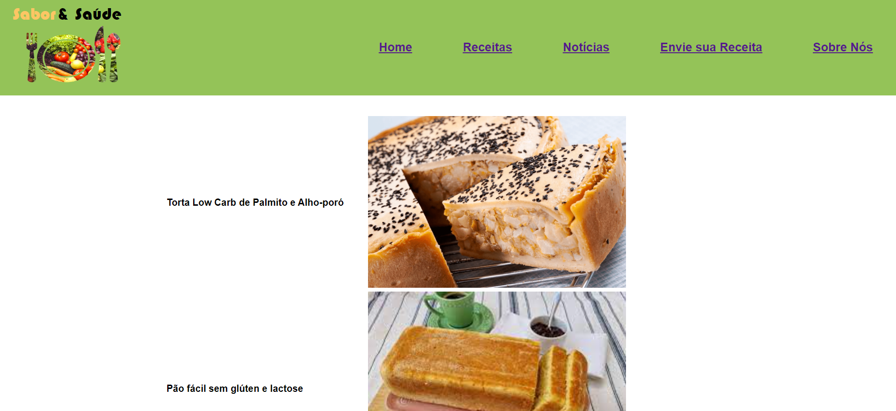

# Programação de Funcionalidades

Pré-requisitos: <a href="2-Especificação do Projeto.md"> Especificação do Projeto</a>, <a href="3-Projeto de Interface.md"> Projeto de Interface</a>, <a href="4-Metodologia.md"> Metodologia</a>, <a href="3-Projeto de Interface.md"> Projeto de Interface</a>, <a href="5-Arquitetura da Solução.md"> Arquitetura da Solução</a>

Implementação do sistema descritas por meio dos requisitos funcionais e/ou não funcionais. Deve relacionar os requisitos atendidos os artefatos criados (código fonte) além das estruturas de dados utilizadas e as instruções para acesso e verificação da implementação que deve estar funcional no ambiente de hospedagem.

Para cada requisito funcional, pode ser entregue um artefato desse tipo. 

<h2>Funcionalidades da página Home. </h2>
A tela principal do programa, a Home Page, apresentada tão logo o cliente acesse o website (www.xxxxxxxxxx.xxx.xx), 
conforme podemos ver na imagem abaixo:

Há também no corpo da Home Page, dois links de receitas, bem como dois links de noticias disponibilizadas no programa, 
a qual os levará à página de receita direta, ou à página de notícias. A Home Page, também contém uma Barra de Busca, que
tem a finalidade de buscar receitas e notícias disponíveis no programa. Ao realizar uma busca de determinada receita ou 
notícia, o programa retornará o resultado com o link para receita ou noticia a qual foi buscado. E caso de não 
existência, retornará o resultado de “Nenhum resultado encontrado”. Conforme imagem abaixo

 <h3>Requisitos atendidos:</h3>
RF-03
 RNF-01
 RNF-02
 RNF-03
 RNF-04
 <h3>Artefatos da funcionalidade:</h3>
Index.html
 Stylehp.css
 <h3>Estrutura de Dados:</h3>
 <h3>Instruções de acesso:</h3>
1.	Abra o navegador de internet em um computador ou dispositivo eletrônico e informe a URL http://www.wwwwwww.www.ww ;
2.	A tela home page será a primeira a ser aberta;
3.	Através da tela aberta, terá a opção de realizar a busca ou acessar às receitas ou noticias disponibilizadas na home page;

<h2>Funcionalidades da página de receitas e as páginas que se desdobram dela. </h2>

As funcionalidades abaixo serão aplicadas nas páginas das receitas. 

 <h3>Requisitos atingidos:</h3>
<b> RF-01</b>	Receitas: O site pode oferecer uma variedade de receitas para diversos públicos, com restrições alimentares ou não.
  <b>RF-04</b>	Compartilhamento nas redes sociais: a possibilidade de compartilhar as receitas nas redes sociais pode ajudar a aumentar a visibilidade do site e permitir que os usuários compartilhem receitas interessantes com seus amigos e familiares.
  <b>RNF-01</b>	Responsivo: O site pode ser visualizado facilmente em diferentes dispositivos, como desktops, laptops e smartphones, sem precisar de zoom ou rolagem horizontal.
  <b>RNF-03</b>	Linguagem simples: a linguagem utilizada no site deve ser simples e acessível para que todos os usuários possam entender as informações presentes.
  <b>RNF-02</b>	Navegabilidade: a interface do site deve ser simples e fácil de navegar, para que os usuários possam encontrar rapidamente as receitas ou notícias que estão procurando.
 <h3>Instruções de acesso:</h3>
1.	Abra um navegador de Internet e informe a seguinte URL: 
2.	A tela de receitas é a primeira funcionalidade exibida pelo aplicativo.
 
3. <h3>Artefatos da funcionalidade:</h3>
receitas.html
 receita_3.html
 receita_2.html
 receita01.html
 receitas.json
 receitas.css

 <h3>Estrutura de Dados:</h3>
{
 "receitas": [
 {
 "id": 1,
 "titulo": "Torta Low Carb de Palmito e Alho-poró",
 "Ingredientes": "2 ovos - 40 gramas de quinoa em flocos - 120 gramas de farinha de castanha de caju
 "Modo de preparo": "Em um liquidificador, coloque os ovos, a quinoa, as farinhas, o azeite, uma pitada de sal, a água e bata bem. ..."
}
]
}

<h2>Funcionalidades da página Notícias. </h2>
 <h3>Requisitos atendidos:</h3>
 <h3>Artefatos da funcionalidade:</h3>
 <h3>Estrutura de Dados:</h3>
 <h3>Instruções de acesso:</h3>

<h2>Funcionalidades da página Sobre Nós. </h2>
A tela apresenta as caracteristicas técnicas descritas nos seguintes requisitos.

<h3>Requisitos atendidos:</h3>
RNF-01
 RNF-02
 RNF-03
 RNF-04

<h3>Artefatos da funcionalidade:</h3>
SobreNos.html
 logo.png
 StyleSobreNos.css
 fotocamila.jpg
 fotocarol.jpg
 fotopaulo.jpg
 fotoruan.jpg
 rosimeire.jpg

<h3>Instruções de acesso:</h3>
1. Abra um navegador de Internet e informe a seguinte URL: 
2. A tela "sobre nós" é a primeira funcionalidade exibida pelo aplicativo.

<h3>Estrutura de Dados:</h3>

{
 "empresa": [
 {
 "ID": 6,
 "Titulo 1": "Sobre nós",
 "Paragrafo": "A Sabor & Saúde é um site composto por um grupo de estudantes de Belo Horizonte..
 "Título 2": "Conheça nosso time"
 "Integrantes": "Rosimeire Carvalho, Paulo Henrique, Camila..." } ] }

<h2>Funcionalidades da página Envie a sua Receita. </h2>
 <h3>Requisitos atendidos:</h3>
 <h3>Artefatos da funcionalidade:</h3>
 <h3>Estrutura de Dados:</h3>
 <h3>Instruções de acesso:</h3>

> **Links Úteis**:
>
> - [Trabalhando com HTML5 Local Storage e JSON](https://www.devmedia.com.br/trabalhando-com-html5-local-storage-e-json/29045)
> - [JSON Tutorial](https://www.w3resource.com/JSON)
> - [JSON Data Set Sample](https://opensource.adobe.com/Spry/samples/data_region/JSONDataSetSample.html)
> - [JSON - Introduction (W3Schools)](https://www.w3schools.com/js/js_json_intro.asp)
> - [JSON Tutorial (TutorialsPoint)](https://www.tutorialspoint.com/json/index.htm)