# Registro de Testes de Software

Pré-requisitos: <a href="3-Projeto de Interface.md"> Projeto de Interface</a>, <a href="8-Plano de Testes de Software.md"> Plano de Testes de Software</a>

Relatório com as evidências dos testes de software realizados no sistema pela equipe, baseado em um plano de testes pré-definido.

## Avaliação

Discorra sobre os resultados do teste. Ressaltando pontos fortes e fracos identificados na solução. Comente como o grupo pretende atacar esses pontos nas próximas iterações. Apresente as falhas detectadas e as melhorias geradas a partir dos resultados obtidos nos testes.

 
<h2>Testes da página Home. </h2>
  1-Testes dos links. Todos os menus estão direcionando para o local correto. 

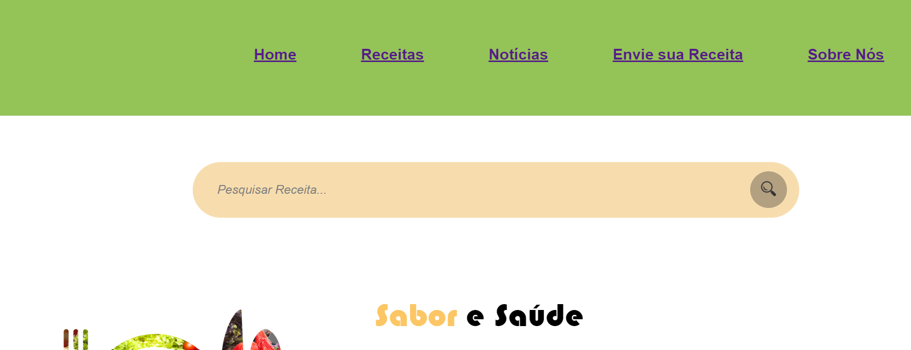

2-Testes da responsividade.
O site não se adpta para outas plataformas, conforme imagem abaixo.
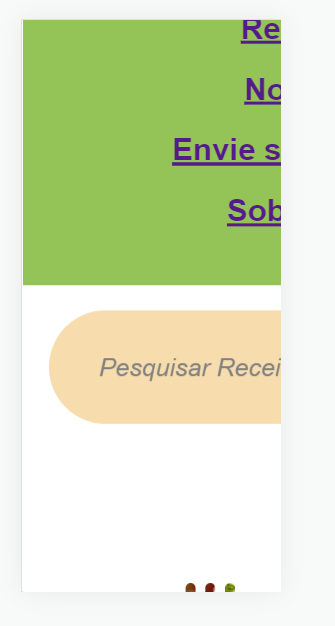
 

2-Testes da barra de pesquisa.
O site está direcionando os resultados das pesquisas para o Google, precisa ser 
corrigido, Paulo ficará responsável por isso na próxima entrega.
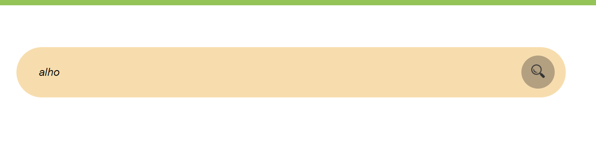

  3-Testes da tela de login e contato.
O ícone está direcionando para as páginas corretamente.
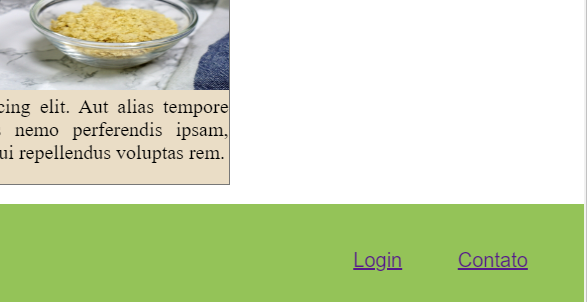  

 
<h2>Testes da página de receitas e as páginas que se desdobram dela. </h2>
  1-Testes dos links. Todos os menus estão direcionando para o local correto. 

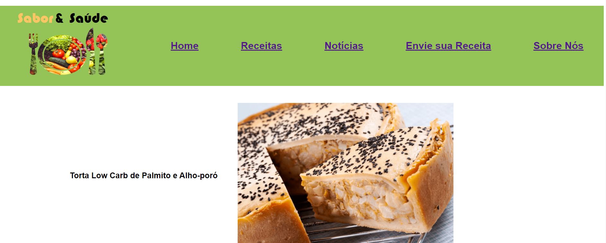

 2-Testes da responsividade.
O site se adpta para outas plataformas conforme exemplo de celular abaixo.
 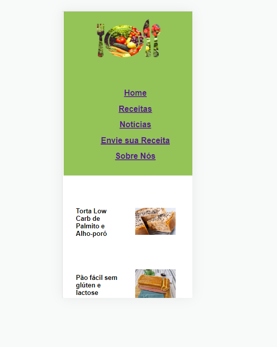
  3-Testes do compartilhamento de redes sociais.
O ícone está direcionando para as redes sociais corretamente.
 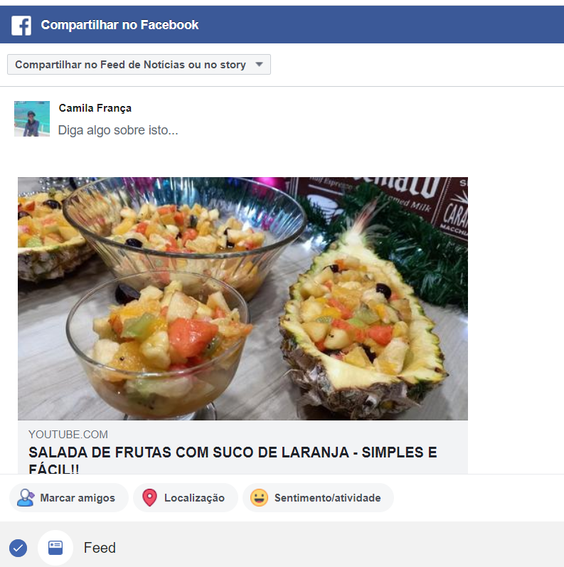
 

 
<h2>Testes da página Sobre Nós. </h2>
  1-Testes dos links. Todos os menus estão direcionando para o local correto. 

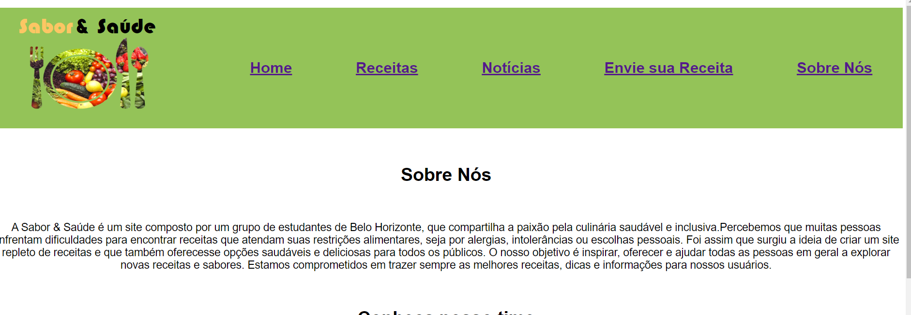

2-Testes da responsividade.
O site se adpta para outas plataformas, conforme imagem abaixo.
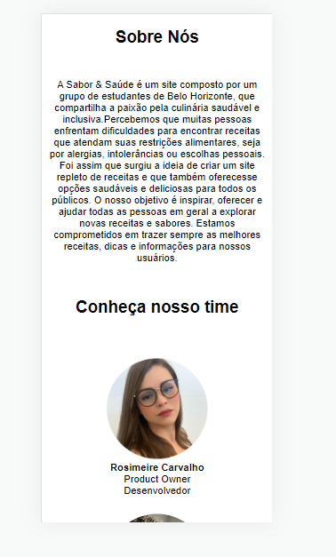
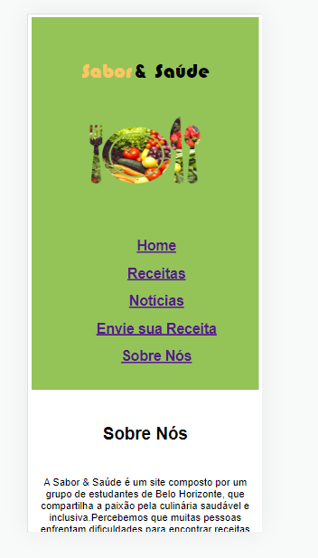
  3-Testes da tela de login e contato.
O ícone está direcionando para as páginas corretamente.

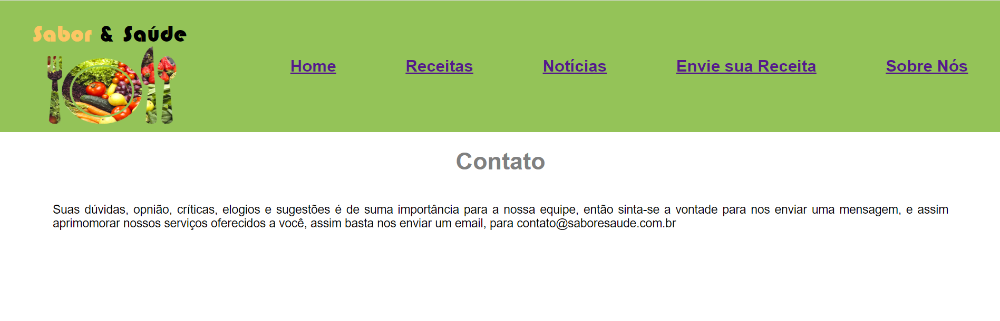
 

> **Links Úteis**:
> - [Ferramentas de Test para Java Script](https://geekflare.com/javascript-unit-testing/)