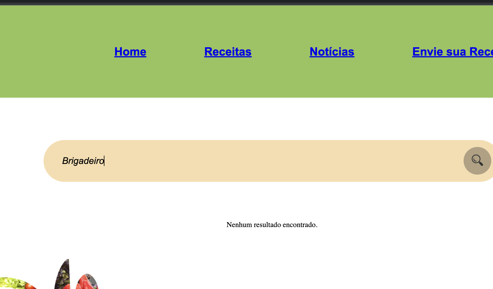

# Registro de Testes de Software

Pré-requisitos: <a href="3-Projeto de Interface.md"> Projeto de Interface</a>, <a href="8-Plano de Testes de Software.md"> Plano de Testes de Software</a>

Relatório com as evidências dos testes de software realizados no sistema pela equipe, baseado em um plano de testes pré-definido.

<h2>Testes da página Home. </h2>
  1-Testes dos links. Todos os menus estão direcionando para o local correto. 

2-Testes da responsividade.
O programa adpta para outas plataformas, conforme imagem abaixo.

 

3-Testes da barra de pesquisa.
O site está direcionando os resultados das pesquisas das receitas e noticias que existem no banco de dados do programa.

4-Testes de falha, de receita ou noticia não existente, indicando a mensagem de "Nenhum Resultado Encontrado", funcionando corretamente.

5-Teste de Sucesso de Links internos do programa: Testes de sucesso dos links no conteudo da Home Page, encaminhando corretamente para todas os links existentes.
  A página Home Page contém quatro links, referente a duas receitas existente e duas nótícias, a qual estão funcionais.

 
<h2>Testes da página de receitas e as páginas que se desdobram dela. </h2>
  1-Testes dos links. Todos os menus estão direcionando para o local correto. 

 2-Testes da responsividade.
O site se adpta para outas plataformas conforme exemplo de celular abaixo.
 
  3-Testes do compartilhamento de redes sociais.
O ícone está direcionando para as redes sociais corretamente.
 
 

<h2>Testes da página Sobre Nós. </h2>
  Caso de testes 1:
  Objetivo: Testar os links.
  Saída esperada: Direcionar o usuário para o local desejado.
  Saída real do sistema: Todos os menus estão direcionando para o local correto.
  Registro de execução: Êxito no teste.

Caso de testes 2:
  Objetivo: Testar a responsividade.
  Saída esperada: Responsividade da tela para diferentes tipos de aparelhos.
  Saída real do sistema: A tela se adpta para outas plataformas, todas as funções disponíveis e visíveis, conforme imagem abaixo.
  Registro de execução: Êxito no teste.

<h2>Testes da página Login. </h2>
  Caso de testes 1:
  Objetivo: Testar a funcionalidade.
  Saída esperada: Após o preenchimento dos campos, fazer login e ser redirecionado para a tela Home.
  Saída real do sistema: Ao informar e-mail e senha, não é efetuado login somente o redirecionado para a tela inicial.
  Registro de execução: Falha no teste.

  Caso de testes 2:
  Objetivo: Testar a funcionalidade.
  Saída esperada: Não permitir o prosseguimento diante da ausência de preenchimento dos campos.
  Saída real do sistema: Mensagem solicitando o preenchimento de todos os campos.
  Registro de execução: Êxito no teste.

  Caso de testes 3:
  Objetivo: Testar a responsividade.
  Saída esperada: Responsividade da tela para diferentes tipos de aparelhos.
  Saída real do sistema: A tela se adpta para outas plataformas, todas as funções disponíveis e visíveis, conforme imagem abaixo.
  Resgistro de execução: Êxito no teste. 

<h2>Teste Tela Envie sua Receita</h2>

  Caso de testes 1:
 Objetivo: testar a funcionalidade.
 Saída esperada: Após o preenchimento de todos os campos, aparecer a mensagem: Receita enviada com sucesso!
 Saída real do sistema:Receita enviada com sucesso! Após análise, sua receita estará disponível na aba “RECEITAS”!
 Registro de execução: Êxito no teste. 

  Caso de testes 2:
 Objetivo: testar a funcionalidade.
 Saída esperada: Não permitir o prosseguimento diante da ausência de preenchimento. 
 Saída real do sistema: "Por favor, preencha todos os campos."
 Registro de execução:Êxito no teste.

 
Caso de testes 3:
 Objetivo: testar a responsividade no smartphone e navegabilidade.
 Saída esperada: Mesmas funções da tela 1920x1080.
 Saída real do sistema: Todas as funções disponíveis e visíveis. 
 Registro de execução: Êxito no teste. 

<h2> Teste tela Notícias </h2>
1-Testes dos links. Todos os menus estão direcionando para o local correto.

2-Testes da responsividade. O programa adapta para outas plataformas, conforme imagens abaixo.

3-Testes de direcionamento link notícia (sites externos):

> **Links Úteis**:
> - [Ferramentas de Test para Java Script](https://geekflare.com/javascript-unit-testing/)