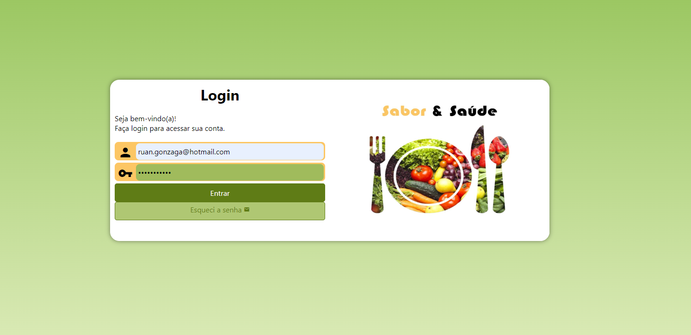

# Registro de Testes de Software

Pré-requisitos: <a href="3-Projeto de Interface.md"> Projeto de Interface</a>, <a href="8-Plano de Testes de Software.md"> Plano de Testes de Software</a>

Relatório com as evidências dos testes de software realizados no sistema pela equipe, baseado em um plano de testes pré-definido.

## Avaliação

Discorra sobre os resultados do teste. Ressaltando pontos fortes e fracos identificados na solução. Comente como o grupo pretende atacar esses pontos nas próximas iterações. Apresente as falhas detectadas e as melhorias geradas a partir dos resultados obtidos nos testes.

 
<h2>Testes da página Home. </h2>
  1-Testes dos links. Todos os menus estão direcionando para o local correto. 

2-Testes da responsividade.
O site não se adpta para outas plataformas, conforme imagem abaixo. Precisa ser corrigido, Paulo ficará responsável
por isso para a próxima entrega. 

 

2-Testes da barra de pesquisa.
O site está direcionando os resultados das pesquisas para o Google, precisa ser 
corrigido, Paulo ficará responsável por isso na próxima entrega.

 3-Testes da tela de login e contato.
O ícone está direcionando para as páginas corretamente.

 
<h2>Testes da página de receitas e as páginas que se desdobram dela. </h2>
  1-Testes dos links. Todos os menus estão direcionando para o local correto. 

 2-Testes da responsividade.
O site se adpta para outas plataformas conforme exemplo de celular abaixo.
 
  3-Testes do compartilhamento de redes sociais.
O ícone está direcionando para as redes sociais corretamente.
 
 

 
<h2>Testes da página Sobre Nós. </h2>
  1-Testes dos links. Todos os menus estão direcionando para o local correto. 

2-Testes da responsividade.
O site se adpta para outas plataformas, conforme imagem abaixo.

  3-Testes da tela de login e contato.
O ícone está direcionando para as páginas corretamente.

 

### História de usuário Tela Envie Sua Receita  

Eu, como usuário, busco auxiliar pessoas com necessidades semelhantes as minhas postando receitas que já tenho hábito de realizar.
 

#### Caso de testes 1:
**Objetivo:** testar a funcionalidade. 
**Saída esperada:** Após o preenchimento de todos os campos, aparecer a mensagem: Receita enviada com sucesso! 
**Saída real do sistema:** Receita enviada com sucesso! Após análise, sua receita estará disponível na aba “RECEITAS”! 
**Registro de execução:** Passou na execução. 

#### Caso de testes 2:
**Objetivo:** testar a funcionalidade.  
**Saída esperada:** Não permitir o prosseguimento diante da ausência de preenchimento.  
**Saída real do sistema:** Por favor, preencha todos os campos. 
**Registro de execução:** Passou na execução. 

#### Caso de testes 3:
**Objetivo:** testar a responsividade no smartphone e navegabilidade.
**Saída esperada:** Mesmas funções da tela 1920x1080.
**Saída real do sistema:** Todas as funções disponíveis e visíveis. 
**Registro de execução:** passou na execução.

> **Links Úteis**:
> - [Ferramentas de Test para Java Script](https://geekflare.com/javascript-unit-testing/)